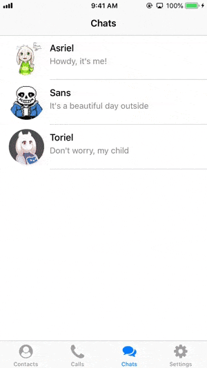
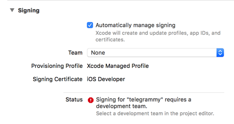

# Telegrammy 2

Updated for iOS 13, because of SceneDelegate.

Sample Xcode project to **demonstrate pushing a view controller into current navigation controller when user open the app by tapping push notification**. This example works when the app is in background and user tap on the push notification.

## Instruction

Make sure you have set the signing certificate in project settings before building this app into your iOS device :

I have made a macOS app to send push notification easily, feel free to [check it out on the Mac App Store](https://itunes.apple.com/us/app/pushever-apns-tester/id1455738387?ls=1&mt=12) .

